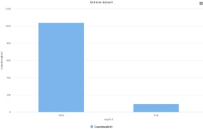
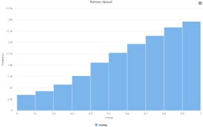
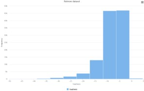
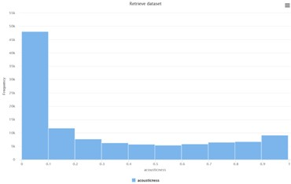
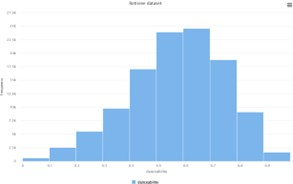
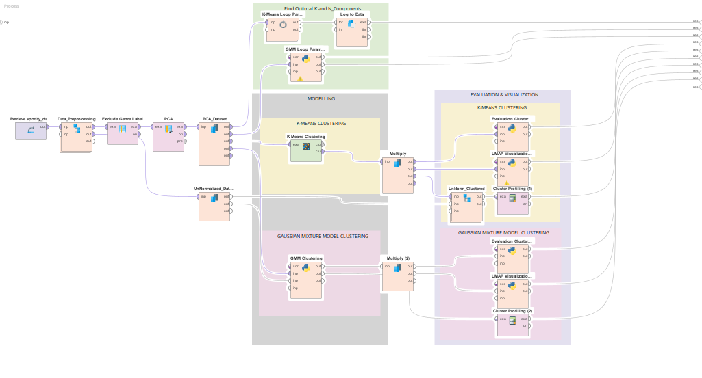

# 🎵 **Spotify Music Genre Classification and Clustering**
    
  
This project focuses on improving music genre classification using machine learning and unsupervised clustering techniques using RapidMiner. Spotify relies on accurate genre labeling for playlist generation, music discovery, and personalized recommendations. However, misclassified tracks are common due to human labeling inconsistencies, leading to irrelevant recommendations and reduced user satisfaction.

To address this, this project uses audio features such as **tempo, energy, danceability, acousticness, and valence** to automatically classify and group songs. Both **supervised** and **unsupervised** approaches are implemented, following the **CRISP-DM** data analytics lifecycle.

This project aims to improve genre detection by:

* Predicting genre using classification models based on quantifiable audio features
* Grouping songs into clusters that reveal natural patterns without relying on labels
* Supporting better recommendations, especially for new or lesser-known artists
* Reducing human bias in genre assignment

---

## 🎯 **Objectives**

* Avoid relying on inconsistent human genre labels
* Reduce labor and human error while improving accuracy
* Improve cold-start recommendations for new artists
* Retain users by providing more relevant recommendations
* Support emerging artists through better genre discoverability

---

## 🔄 **CRISP-DM Methodology**

This project follows the **CRISP-DM** lifecycle:

1. **Business Understanding**
2. **Data Understanding**
3. **Data Preparation**
4. **Modeling**
5. **Evaluation**
6. **Deployment**

---

## 🧰 **Prerequisites**

Before running this project, ensure you have:

**[RapidMiner Altair Studio](https://docs.rapidminer.com/latest/studio/installation/index.html#from-rapidminer)**  
Required version: *2025.1.0 or newer recommended*

---

## 📂 **Dataset Preparation**

### **1. Dataset Description**

The Spotify Tracks dataset from Kaggle contains:

* **21 columns** (audio features + genre)
* **114 different genres**
* **~1000 tracks per genre**
* **114,000 rows total**

Audio features include:
*acousticness, danceability, energy, valence, loudness, instrumentalness, tempo, speechiness, duration_ms, etc.*
> The dataset is in [Dataset](dataset.csv), you can also browse in [Kaggle](https://www.kaggle.com/datasets/maharshipandya/-spotify-tracks-dataset)

---

### **2. Exploratory Data Analysis (EDA)**

Below is the required table format (left = EDA images, right = findings).
*(Replace the placeholders on the left with your uploaded images.)*

| **EDA Graphs** | **Description**                                                                                                                                      |
| -------------- | ---------------------------------------------------------------------------------------------------------------------------------------------------- |
|   | **Explicit:** Majority of tracks are **not explicit**, with mode = 1.                                                                                |
|   | **Energy:** Left-skewed, increasing toward 1. Most songs fall between **0.4–0.9**. Indicates a high number of energetic tracks.                      |
|   | **Loudness:** Slightly left-skewed, close to normal distribution. Most tracks between **-15 to -5 dB**.                                              |
|   | **Acousticness :** Strong right-skew. Most songs have low values. Instrumentalness has few mid-range values.                                         |
|   | **Danceability:** Roughly normal distributions. Most tracks fall in moderate ranges. Very few extremes.                                              |

---

### **3. Preprocessing for Supervised & Unsupervised Models**

1. Excluded irrelevant column: `att1`
2. Removed duplicate records
3. Selected audio features + genre
4. Removed missing values
5. Set attribute roles (features vs label)
6. Converted nominal values to numeric
7. Normalized all audio features

---

## 🤖 **Machine Learning Models**

   

### 1️⃣ **Supervised Learning (Genre Classification)**

* **Random Forest Classifier**
* **Gradient Boosted Trees**

### 2️⃣ **Unsupervised Learning (Clustering)**

* **K-Means Clustering**
* **Gaussian Mixture Model (GMM)**

These methods help identify genre patterns, evaluate similarity across songs, and uncover natural clusters without labels.

---

## 🧪 **Model Validation**

* Evaluation metrics include:

  * Accuracy
  * Confusion matrix
  * Silhouette score (for clustering)
* Hyperparameter tuning performed to optimize model performance
* Feature importance analyzed for interpretability

---

## 📊 **Experimental Results & Findings**

### 💻 **Supervised Learning: Genre Classification**

🔍 **Performance Comparison:**

| Metric                  | Random Forest  | Gradient Boosted Trees |
| ----------------------- | -------------- | ---------------------- |
| Accuracy                | 43.39% ± 0.34% | 45.20% ± 0.29%         |
| Weighted Mean Recall    | 26.29% ± 0.34% | 31.84% ± 0.55%         |
| Weighted Mean Precision | 45.09% ± 2.83% | 41.58% ± 1.13%         |

💡 **Key Insights:**

* Both models achieved moderate accuracy, with Gradient Boosted Trees slightly outperforming Random Forest.
* Low recall indicates that many tracks were misclassified, while moderate precision shows the models correctly predicted genres when confident.
* Model performance is limited by feature dominance (e.g., loudness and energy) and overlapping genre characteristics.

📌 **Recommendations for Improvement:**

1. **Dataset Level**

   * Collect more balanced and diverse tracks to reduce bias.
   * Include additional audio features (e.g., spectral contrast, rhythm complexity, harmonic descriptors).
   * Apply feature selection to minimize dominant features’ influence.

2. **Model Level**

   * Explore deep learning models such as CNNs for complex pattern recognition.
   * Consider ensemble techniques like model stacking to improve accuracy.

3. **Task Level**

   * Implement multi-label classification to reflect tracks belonging to multiple genres.
   * Better captures real-world music relationships and improves prediction realism.

---

### 💻 **Unsupervised Learning: Song Clustering**

🔍 **Evaluation Scores:**

| Algorithm | Silhouette Score | Davies-Bouldin Index | Calinski-Harabasz Index |
| --------- | ---------------- | -------------------- | ----------------------- |
| K-Means   | 0.142            | 1.984                | 16121.716               |
| GMM       | 0.149            | 1.499                | 10939.075               |

💡 **Key Insights:**

* Both clustering methods captured some structure in the data, with GMM slightly outperforming K-Means in Silhouette and Davies-Bouldin metrics.
* High number of genres and overlapping characteristics make clusters less clearly separated.
* Clusters may reflect similarity in audio features rather than strict genre boundaries.

📌 **Recommendations for Improvement:**

1. **Dimensionality Reduction**

   * Use autoencoders or other deep learning methods to capture non-linear patterns beyond PCA.

2. **Metadata Integration**

   * Incorporate additional features like mood, tempo, and user-generated tags for richer context.

3. **External Validation**

   * Use grouped genres (e.g., pop, rock, jazz) as benchmarks.
   * Evaluate with metrics like Adjusted Rand Index (ARI) or Normalized Mutual Information (NMI).

4. **Alternative Clustering Methods**

   * Explore hierarchical clustering or spectral clustering to capture more complex relationships.

---

## 📝 **Acknowledgements**

Special thanks to:

* **My lecturer**, for the continuous guidance throughout the project
* **My teammate**, for the collaboration and contribution to model development, EDA, and documentation

---
